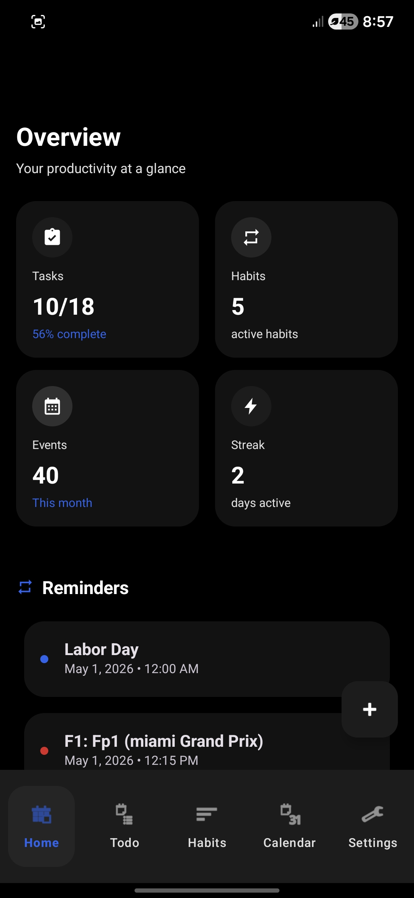
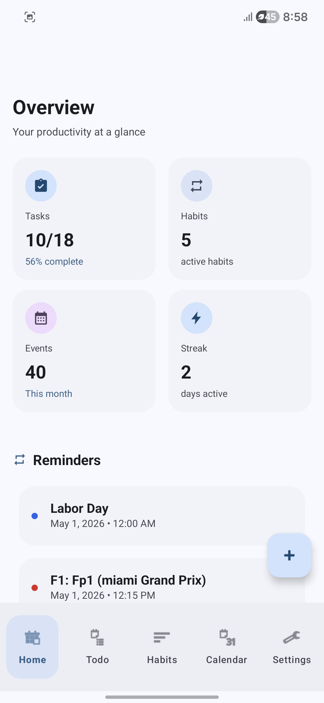
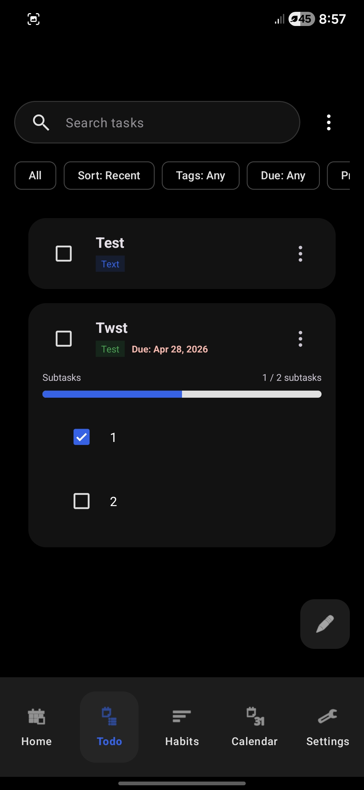
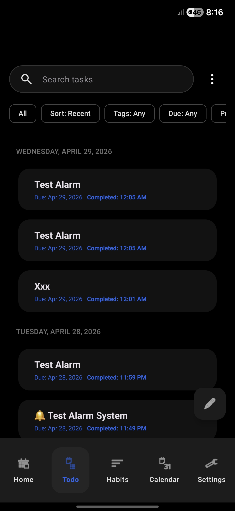
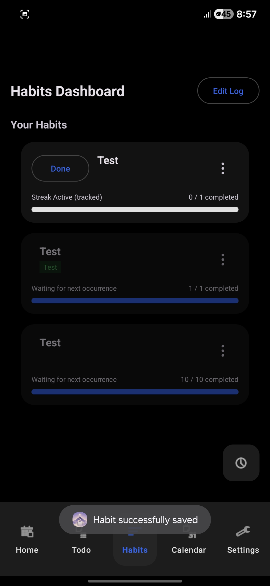
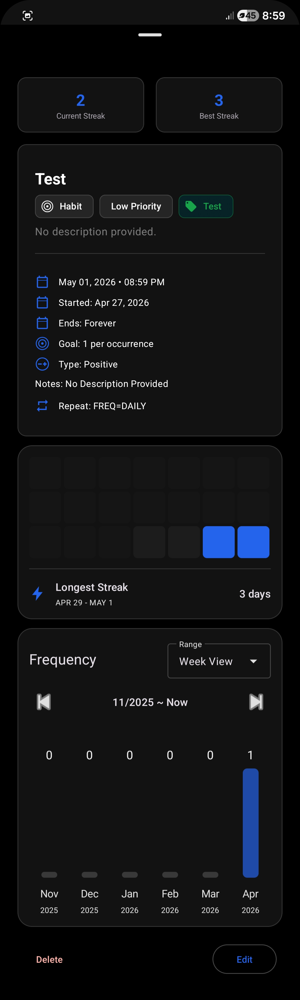
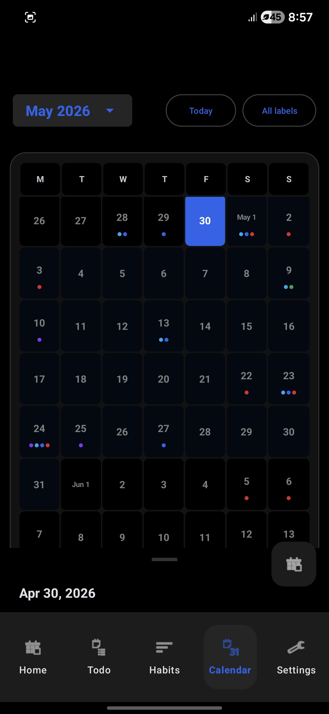
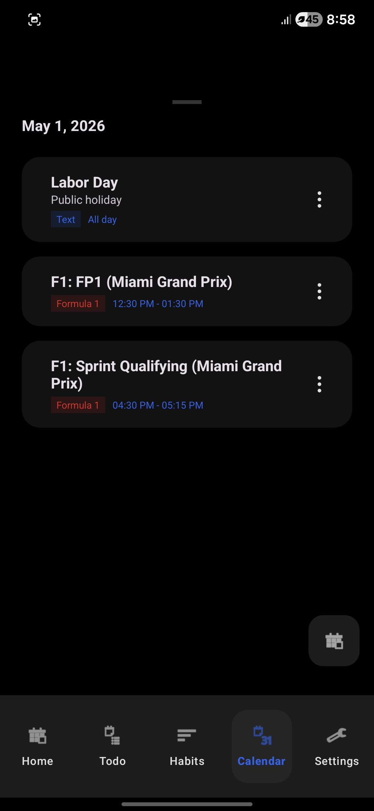
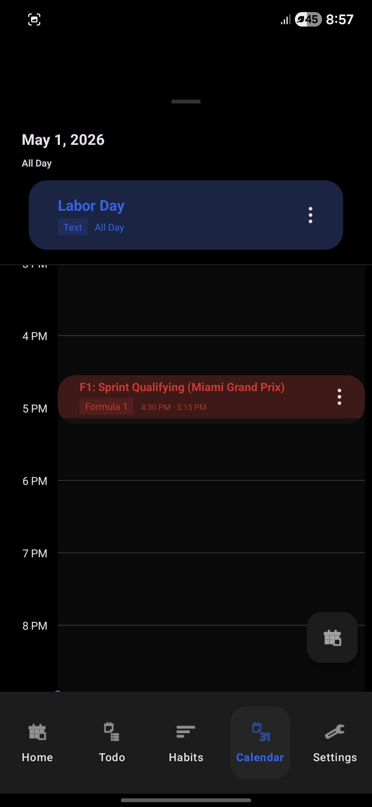

# Astra – Android Life Oragnizer App

``` This repository is several commits behind ```

Astra is a **local-first Android productivity app meant to help manage your daily life. It combines **tasks, habits, and calendar scheduling** into a single offline-capable experience. It follows an MVVM architecture, uses a Room DB and implements a **Material 3 UI**.


---

## ✨ Features

### ✅ Tasks (To-Do)



* Create, edit, prioritize, and organize tasks
* Due dates, reminders, subtasks, and recurrence
* Completion history tracking
* Filtering, sorting, and search

### 🔁 Habits



* Daily habit tracking with target counts
* Streak calculation and completion history
* Visual insights (heatmap and frequency chart)
* Positive/negative habit support

### 📅 Calendar




* Schedule events with start/end times or all-day mode
* Multiple views: **Schedule, List, Agenda**
* Recurring events and reminders
* Optional integration of tasks & habits into calendar

### 🔔 Notifications & Widgets

* Alarms and reminders (with snooze)
* Customizible daily reminders
* Daylight savings time reminders
* Home screen widgets

### ⚙️ Settings & Customization

* Theme (Material You, dark mode, AMOLED)
* Default values (priority, reminders, duration, recurrence)
* Calendar preferences (week start, visibility)
* Privacy (biometric lock, screenshot blocking)
* Label color cus
tomization
* Label Templates

### 💾 Data Management

* Fully offline, local-first storage
* JSON backup & restore
* ICS calendar import/export
* No account or cloud required

---

## 🏗️ Architecture

* **Language:** Java
* **Pattern:** MVVM
* **Database:** Room (`astra_database`)
* **State:** LiveData
* **Preferences:** SharedPreferences
* **UI:** Fragments + Material 3
* **Background:** AlarmManager + BroadcastReceivers
* **Widgets:** AppWidgetProvider

### Core Data Model

* `items` → unified table for tasks, habits, events
* `item_occurrences` → recurring instances
* `completion_history` → immutable action logs
* `subtasks`, `reminders`, `projects`, `calendars`

---

## 📦 Core Concepts

* **Item:** Base model for tasks, habits, and events
* **Occurrence:** A scheduled instance of a recurring item
* **Completion History:** Immutable log of actions (done, skipped, etc.)
* **Local-first:** No backend; all data stored on-device

---

## 🔑 Functional Highlights

* Create/edit/delete tasks, habits, and events
* Recurring logic for all item types
* Habit streaks based on historical continuity
* Calendar filtering (labels, tasks, habits)
* Alarm scheduling for high-priority items
* Full backup/restore with data integrity

---

## ⚡ Non-Functional Goals

* Smooth performance with local datasets
* Offline reliability
* Secure (biometric lock, screenshot blocking)
* Maintainable modular architecture
* Responsive Material 3 UI