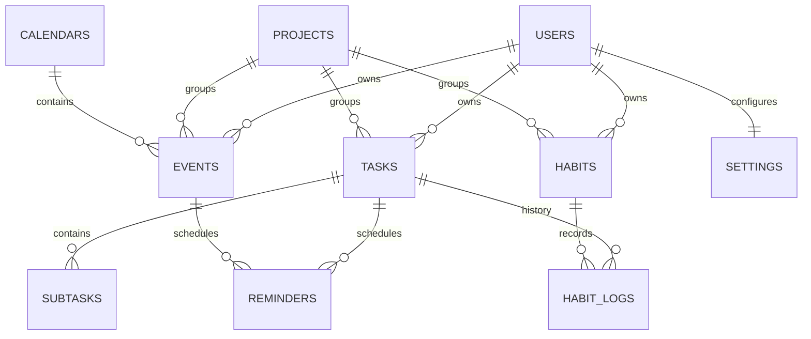

# Software Requirements Specification for Astra

**Product:** Astra  
**Platform:** Android  
**Architecture style:** Local-first, MVVM, Room-backed, Material 3 UI  
**Codebase basis:** Current `app/` implementation in this workspace

## 1. Introduction

### 1.1 Purpose
Astra is an Android productivity application that combines three core workflows in one local, offline-capable app:

1. Habit tracking
2. To-do and task management
3. Calendar scheduling

This SRS defines the functional and non-functional requirements for the current product direction and the expected behavior of the app as implemented in the codebase. It is intended for developers, QA engineers, designers, and maintainers working on the Astra Android client.

### 1.2 Scope
Astra provides a single-device productivity workspace with:

- Task creation, editing, prioritization, completion, subtasks, reminders, and history
- Habit definition, daily completion counting, streak tracking, and visual progress analytics
- Calendar scheduling with schedule, events list, and agenda-style views
- Alarm and recap notifications
- Theme, privacy, default-behavior, data-export, and widget-related settings
- Local backup and restore flows

The app is designed to operate without a server account model. Data is stored locally using Room and SharedPreferences, with export/import features for portability and recovery.

### 1.3 Definitions and Acronyms

| Term | Meaning |
|---|---|
| Item | The primary polymorphic record used by the app for tasks, habits, and events |
| Todo | A task item with due-date semantics and completion history |
| Habit | A recurring behavior item with daily target counts and streaks |
| Event | A scheduled calendar item with optional all-day support |
| Occurrence | A dated execution instance for recurring items or habit tracking |
| Completion history | Immutable log of item actions such as done, uncompleted, skipped, or canceled |
| M3 | Material 3, the Android design system used by the UI |
| Room | Android persistence library used as the local SQLite abstraction |
| LiveData | Lifecycle-aware observable data stream used by view models and fragments |

## 2. Overall Description

### 2.1 Product Perspective
Astra is a native Android application built in Java using AndroidX, Material Components, Room, LiveData, and a repository/view-model fragment architecture.

The current codebase shows a local-first architecture:

- UI is organized into fragments, bottom sheets, adapters, and custom views.
- Business logic is split across repositories and utility classes.
- Persistence is divided between Room for structured app data and SharedPreferences for user settings.
- Background scheduling relies on AlarmManager, broadcast receivers, and notification helpers.
- Widgets are supported through AppWidgetProvider implementations.

Current physical storage model:

- Room database name: `astra_database`
- Room entities: `items`, `item_occurrences`, `completion_history`, `subtasks`, `reminders`, `projects`, `calendars`
- Preferences store: `astra_datastore_prefs`

### 2.2 User Personas

| Persona | Description | Primary Needs |
|---|---|---|
| Busy professional | Manages deadlines, alarms, meetings, and recurring routines during a workday | Fast item creation, reminders, calendar visibility, widgets |
| Habit builder | Tracks repeated actions such as workouts, study streaks, medication, or journaling | Habit streaks, daily targets, visual progress, low-friction logging |
| Student | Balances assignments, classes, and time-blocked events | Due dates, agenda view, label organization, exportable backups |
| Privacy-conscious user | Wants all data local and control over screenshots/biometrics | Local storage, app lock, screenshot blocking, offline operation |
| Power user | Uses widgets, calendar import, recurring items, and recurring briefs | Automation, defaults, shared labels, calendar integration, recap notifications |

### 2.3 Assumptions

1. The app is used primarily on a single Android device at a time.
2. The user can grant required runtime permissions when prompted.
3. The user accepts local persistence as the primary storage model.
4. Calendar and contacts import features depend on device permissions and available content providers.
5. Exact alarm behavior may depend on Android version and device-specific power management policies.
6. Users may export and restore their own data, but there is no cloud sync system in the current product.

### 2.4 Constraints

#### Technical Constraints
- Minimum SDK: Android 11 / API 30
- Target SDK: Android 14 / API 34
- Language: Java
- Persistence: Room + SharedPreferences
- UI toolkit: Material 3 / Material Components
- Background scheduling: AlarmManager, receivers, foreground service for full-screen alarms
- Backup/export: JSON and ICS file flows
- Widgets: AppWidget framework

#### Platform Constraints
- Exact alarms require platform permission on newer Android versions.
- Notification permission is required on Android 13+ for visible notifications.
- Biometric locking requires supported device hardware or credential fallback.
- Contacts/calendar import depends on device permission grants and provider availability.

#### Business / Product Constraints
- The app is local-first and does not currently define a server-side account system.
- The current database uses destructive migration fallback, so schema changes can reset data unless migration support is added.
- Some preference values are stored outside the database in SharedPreferences, not in Room tables.

## 3. System Features

### 3.1 To-Do Module

The to-do module manages actionable work items and supports a broad set of productivity behaviors:

- Task creation and editing
- Priority assignment
- Due-date handling
- Optional reminders
- Subtasks
- Status transitions such as pending, done, and archived
- Completion history
- Recurrence-aware behavior for repeatable tasks
- List filtering and sorting

Core behaviors observed in the code:

- Tasks are represented by the polymorphic `Item` model with `type = "todo"`.
- A task may store title, description, label, priority, status, due time, reminder time, recurrence rule, and project association.
- High-priority tasks can trigger alarm scheduling when they have a valid time.
- Completion toggles write a `CompletionHistory` record.
- Recurring tasks can advance their due date to the next occurrence when completed.
- The task list screen supports search, sorting, tag filtering, due-date filtering, and priority filtering.
- The task history view allows review of historical completion data.
- Subtasks are stored separately and attached to the parent task by `itemId`.

### 3.2 Habits Module

The habits module tracks repeated behaviors with completion counts and streak analytics.

#### Core Functionality
- Create positive or negative habits
- Set daily target counts
- Track occurrences by day
- Record completion history
- Compute streaks
- Show heatmaps and frequency charts
- Inspect individual habit detail and edit logs

#### System Architecture
The habit subsystem is implemented in Java and uses:

- Room for persistence
- LiveData for reactive UI updates
- RecyclerView adapters for list presentation
- Material 3 widgets and bottom sheets for detail and editing flows
- Android utility classes for date formatting and recurrence logic

The habit flow relies on these core data abstractions:

- `Item` with `type = "habit"`
- `ItemOccurrence` for per-day execution state
- `CompletionHistory` for immutable action history

#### Tracking Logic
- A habit has a daily target count.
- The app creates or reuses a day-specific `ItemOccurrence`.
- Each completion increments `currentCount`.
- When the count reaches the daily target, the occurrence becomes complete.
- Each completion also records a `CompletionHistory` row.
- Streak logic is derived from contiguous dates in the completion history.

#### Key User Interactions
- Mark habit as done from the tracker list
- Open habit detail to inspect streaks and charts
- Edit completion logs for a given habit
- Delete selected habits with their history
- Filter and sort habits by validity for the current day and completion state

### 3.3 Calendar Module

The calendar module presents scheduled work in day-grid and list-oriented views.

#### Event Scheduling
- Create events with start time, end time, and all-day mode
- Assign reminders and priority
- Schedule alarms for eligible events
- Show event countdown notifications for imminent alarms
- Support recurring events through recurrence rules

#### Integration with Tasks and Habits
- Calendar settings can toggle whether tasks and habits appear in calendar views.
- The calendar can show tasks with time semantics and habits with duration semantics when enabled.
- The calendar screen integrates label filters and a selected-date bottom sheet timeline.

#### Time-Based Views
The codebase exposes three main calendar modes:

| View | Purpose |
|---|---|
| Schedule | Calendar grid with a timeline-oriented lower panel |
| Events List | Flat list of calendar items |
| Event Agenda | Chronological agenda for a selected date range |

Additional behaviors:

- Today is visually emphasized in the day grid.
- Event dots indicate scheduled items for a date.
- The current day uses an outlined event-dot treatment to improve legibility.
- Week numbers and week-start behavior are configurable.
- ICS import/export is supported.

### 3.4 Settings Module

The settings module is broad and central to Astra's behavior. It controls appearance, navigation, calendar behavior, defaults, summaries, alarms, privacy, widgets, and data management.

#### 3.4.1 Overview
Settings are stored primarily in `SharedPreferences` via `SettingsRepository`. Many settings directly affect runtime UI or background scheduling and are read by fragments, widgets, alarm schedulers, and recap schedulers.

#### 3.4.2 Detailed Settings Table

| Setting | Type | Default | Description | Impact on System Behavior |
|---|---|---:|---|---|
| Page: Home | Switch | On | Enables the Home page in bottom navigation | Removes or restores the landing dashboard page |
| Page: Todo | Switch | On | Enables the Todo list page | Controls access to task management navigation |
| Page: Habits | Switch | On | Enables the Habit tracker page | Controls access to the habit tracking navigation |
| Page: Calendar | Switch | On | Enables the Calendar page | Controls access to calendar scheduling navigation |
| Dynamic theming | Switch | On | Uses Material You system colors when available | Changes whether the app uses system-derived colors or a fixed accent palette |
| Accent color | Chip group | Blue | Manual accent palette when dynamic theming is disabled | Changes the non-dynamic palette used by the theme |
| Dark mode | Spinner | System | Selects system, dark, or light appearance | Changes the app-wide night mode policy |
| Black theme | Switch | Off unless dark mode is selected | Uses AMOLED-style black palettes in dark mode | Switches dark theme surfaces to near-black variants and is disabled in light mode |
| Date format | Spinner | Medium | Chooses how dates are rendered throughout the app | Updates all formatted date strings in UI and exports that use the shared formatter |
| Time format | Spinner | 12-hour | Chooses 12-hour or 24-hour clock display | Updates time pickers, labels, and summaries |
| Show week numbers | Switch | Off | Displays week numbers in the calendar grid | Adds week-number labels to month/week calendar rows |
| Start of week | Spinner | Sunday | Sets the first weekday shown in weekly grids | Reorders calendar headers and date placement |
| Show tasks in calendar | Switch | Off | Shows task items in calendar views | Makes timed to-dos appear in calendar timelines or lists |
| Show habits in calendar | Switch | Off | Shows habit items in calendar views | Makes timed habits appear in calendar views |
| Default reminder | Spinner | None | Prefills reminder offset for new items | Reduces user effort when creating tasks or events |
| Default priority | Spinner | Medium | Prefills priority for new items | Influences alarm behavior and scheduling defaults |
| Default duration | Spinner | 1 hour | Prefills duration for new timed events | Determines the default end-time window when none is supplied |
| Default habit/task repeat | Spinner | Daily | Prefills recurrence when repeat is enabled | Reduces friction when creating recurring items |
| Default calendar view | Spinner | Last used view | Selects the first calendar mode to open | Changes startup behavior for the Calendar screen |
| Morning brief | Switch | Off | Enables a morning summary notification | Schedules recap notifications for the configured morning time |
| Morning time | Time button | 08:00 | Sets the time for the morning brief | Controls when recap scheduling runs |
| Evening wrap | Switch | Off | Enables an evening wrap-up notification | Schedules recap notifications for the configured evening time |
| Evening time | Time button | 18:00 | Sets the time for the evening wrap | Controls when recap scheduling runs |
| Alarm ringtone | Button | System default | Selects the system alarm tone | Changes the ringtone used by alarms and related notification flows |
| Biometric lock | Switch | Off | Requires biometric or device credential unlock | Adds an application-level privacy gate |
| Prevent screenshots | Switch | Off | Blocks screenshots and screen recording | Applies secure-window behavior to sensitive screens |
| Haptics | Switch | On | Enables tactile feedback in supported interactions | Controls vibration/haptic feedback usage |
| Import birthdays | Switch | Off | Imports birthdays from contacts as all-day events | Requires contacts permission and populates imported birthday items |
| Auto import interval | Spinner | Disabled | Controls automatic import cadence for calendar sync sources | Changes import scheduling behavior if import is enabled |
| Import local calendar | Internal / latent | Disabled | Present in settings storage but not currently surfaced as a dedicated toggle | Indicates future or partially implemented calendar import behavior |
| Purge archived | Action | Idle | Permanently removes archived items from local storage | Deletes archived data without wiping active items |
| Export backup | Action | Idle | Exports all local data as JSON | Creates a portable backup file |
| Restore backup | Action | Idle | Imports a JSON backup | Wipes and restores local database content |
| Export calendar | Action | Idle | Exports items to ICS | Produces an interoperable calendar file |
| Widget picker | Action | Idle | Opens widget previews | Helps users configure available home-screen widgets |
| Reset app | Action | Idle | Clears all local data and preferences | Performs a full local wipe and recreates the app state |
| Label manager | Action | Idle | Renames, merges, or deletes labels | Updates label usage across upcoming and active items and associated color state |
| Per-label color assignment | Derived preference | Fallback accent | Stores a color for each normalized label | Drives label-specific accent rendering in lists and item views |

#### 3.4.3 Settings Behavior Rules

1. The app must keep at least one functional core page visible.
2. Black theme must be disabled when light mode is selected.
3. Switching dark mode can affect whether the AMOLED black palette is applied.
4. Export and restore operations must operate on local files and must not require a network connection.
5. Data reset must wipe tasks, habits, occurrences, subtasks, and history, then refresh widgets and scheduling state.
6. Alarm and recap time changes must reschedule affected notifications immediately.

## 4. Functional Requirements

| ID | Requirement | Acceptance Criteria |
|---|---|---|
| FR-01 | The system shall allow the user to create a task, habit, or event with title, notes, label, and scheduling metadata. | A newly created item appears in the relevant list after save; missing required title prevents save with a toast. |
| FR-02 | The system shall allow the user to edit an existing item and persist changes. | Editing a saved item updates the existing record rather than creating a duplicate. |
| FR-03 | The system shall support item priority levels. | Priority values persist and are reflected in list styling, alarm scheduling, and default selections. |
| FR-04 | The system shall support due dates, start times, end times, and all-day mode. | Timed items display correctly in calendar and event views; all-day items render as full-day entries. |
| FR-05 | The system shall reject events with neither a date nor a time. | Attempting to save such an event shows a toast warning and no item is inserted. |
| FR-06 | The system shall support subtasks for tasks. | Subtasks are saved, loaded, updated, and deleted with the parent task lifecycle. |
| FR-07 | The system shall track item completion history. | Every completion or state change that matters to history results in a persisted history entry. |
| FR-08 | The system shall support recurring items. | Recurring tasks/habits/events calculate the next occurrence using the recurrence parser and update scheduling state accordingly. |
| FR-09 | The system shall support high-priority alarms and reminders. | Eligible high-priority items trigger notifications or alarms when scheduled for the future. |
| FR-10 | The system shall support snoozing alarms by 10 minutes. | Snooze recreates the notification schedule at a 10-minute offset and presents a countdown notification. |
| FR-11 | The system shall support habit daily target counting. | A habit reaches completion only when the current count equals the configured daily target. |
| FR-12 | The system shall compute habit streaks from completion history. | Habit detail shows current and best streak values that reflect contiguous completion days. |
| FR-13 | The system shall display calendar views for schedule, events list, and agenda. | Each view can be selected and rendered without losing the selected date context. |
| FR-14 | The system shall show event dots in the month calendar and outline dots for today. | Days with multiple events display all relevant markers for today and compact indicators for other days. |
| FR-15 | The system shall support calendar filtering by labels, tasks, and habits. | Filter selections change which items appear in the calendar views and timelines. |
| FR-16 | The system shall allow users to import and export calendar data. | ICS import/export produces valid files and imported items are stored locally. |
| FR-17 | The system shall allow users to create and restore a full JSON backup. | Export writes all core local data; restore wipes and repopulates the local database successfully. |
| FR-18 | The system shall support privacy controls for biometric lock and screenshot blocking. | When enabled, the app requests biometric unlock and blocks screenshots where required. |
| FR-19 | The system shall allow users to configure defaults for reminder, priority, duration, recurrence, and calendar view. | New item creation screens prefill values from settings. |
| FR-20 | The system shall support widgets and recap notifications. | Widgets refresh when relevant data changes; morning and evening summary notifications reschedule after settings changes. |
| FR-21 | The system shall enforce page-visibility constraints. | The user cannot disable the last remaining functional core page. |
| FR-22 | The system shall support per-label color customization. | Label color changes affect label rendering and persist across app restarts. |

## 5. Non-Functional Requirements

| ID | Quality Attribute | Requirement | Acceptance Criteria |
|---|---|---|---|
| NFR-01 | Performance | Database writes must not block the UI thread. | Inserts, updates, deletes, and backup operations execute through background executors. |
| NFR-02 | Performance | Core lists must remain responsive with moderate local datasets. | List and calendar screens scroll and filter without visible jank in normal usage. |
| NFR-03 | Reliability | Alarm and recap scheduling must survive device reboot when permissions allow. | Boot and permission receivers reschedule expected notifications after restart. |
| NFR-04 | Reliability | Data export and restore must be recoverable from parse failures. | Invalid backup input fails safely and does not corrupt existing state. |
| NFR-05 | Security | Sensitive screens must honor biometric lock and screenshot prevention. | The app can require unlock and can suppress screen capture when enabled. |
| NFR-06 | Security | The app should follow least-privilege permission usage. | Permissions are requested only when their related feature is enabled or used. |
| NFR-07 | Usability | The UI should follow Material 3 spacing, typography, and surfaces. | Screens use consistent Material 3 components and readable spacing. |
| NFR-08 | Usability | Important actions should give immediate feedback. | Save, delete, import, export, purge, and reset flows show clear toasts or dialogs. |
| NFR-09 | Scalability | The app should handle growth in local item counts without schema redesign. | The repository and DAO layer support more data without changing core UI contracts. |
| NFR-10 | Maintainability | Feature logic should be isolated by responsibility. | UI, persistence, scheduling, and export logic remain separated into fragments, repositories, and utilities. |
| NFR-11 | Portability | The app should run on Android 11 and above. | The app compiles and operates on API 30+ devices. |
| NFR-12 | Data Integrity | Restoring or deleting data must keep related entities consistent. | Parent deletions cascade or are manually cleaned up so orphaned records are not left behind. |

## 6. Database Design

### 6.1 ER Overview

The current implementation uses a polymorphic `items` table for tasks, habits, and events. For SRS clarity, the logical model below separates those concerns. The physical schema in the codebase partially normalizes the model through `items`, `item_occurrences`, `completion_history`, `subtasks`, `reminders`, `projects`, and `calendars`.

### 6.2 Logical Tables

#### 6.2.1 Users
| Field | Type | Notes |
|---|---|---|
| id | INTEGER PK | Logical user identifier |
| display_name | TEXT | Optional profile name |
| created_at | INTEGER | Epoch millis |
| updated_at | INTEGER | Epoch millis |
| is_primary | INTEGER | Singleton profile flag |

Relationship:
- One user owns many tasks, habits, and events.
- One user has one settings record in the logical model.

Implementation note:
- The current app does not persist a formal `users` table. Astra is effectively a single-user local app, and user preferences live in SharedPreferences.

#### 6.2.2 Tasks
| Field | Type | Notes |
|---|---|---|
| id | INTEGER PK | Item identifier |
| user_id | INTEGER FK | References Users |
| project_id | INTEGER FK NULL | Optional grouping |
| title | TEXT | Required |
| description | TEXT | Optional |
| priority | INTEGER | None, Low, Medium, High |
| status | TEXT | pending, done, archived |
| due_at | INTEGER NULL | Deadline timestamp |
| reminder_at | INTEGER NULL | Notification timestamp |
| recurrence_rule | TEXT NULL | Repeat descriptor |
| label | TEXT NULL | Normalized label name |
| created_at | INTEGER | Epoch millis |
| updated_at | INTEGER | Epoch millis |

Relationships:
- One task can have many subtasks.
- One task can have many reminders.
- One task can have many history entries.
- One task can participate in recurrence generation.

Implementation mapping:
- Current Room entity: `Item` with `type = "todo"`
- Related tables: `subtasks`, `reminders`, `completion_history`, `item_occurrences`

#### 6.2.3 Habits
| Field | Type | Notes |
|---|---|---|
| id | INTEGER PK | Item identifier |
| user_id | INTEGER FK | References Users |
| project_id | INTEGER FK NULL | Optional grouping |
| title | TEXT | Required |
| description | TEXT | Optional |
| is_positive | INTEGER | Positive or negative habit |
| daily_target_count | INTEGER | Required target count |
| start_at | INTEGER NULL | Habit start timestamp |
| end_at | INTEGER NULL | Optional habit end timestamp |
| recurrence_rule | TEXT | Habit schedule |
| streak_enabled | INTEGER | Habit tracking enabled |
| status | TEXT | pending, done, archived |
| label | TEXT NULL | Normalized label name |
| created_at | INTEGER | Epoch millis |

Relationships:
- One habit can have many daily habit logs.
- One habit can have many occurrences.
- One habit can have many completion history records.

Implementation mapping:
- Current Room entity: `Item` with `type = "habit"`
- Related tables: `item_occurrences`, `completion_history`

#### 6.2.4 HabitLogs
| Field | Type | Notes |
|---|---|---|
| id | INTEGER PK | Log identifier |
| habit_id | INTEGER FK | References Habits |
| occurrence_id | INTEGER FK NULL | References an occurrence row if available |
| action | TEXT | done, uncompleted, skipped, missed, canceled, rescheduled |
| timestamp | INTEGER | Epoch millis |

Relationships:
- One habit has many habit logs.
- A log may optionally attach to a specific occurrence.

Implementation mapping:
- Current Room entity: `CompletionHistory`
- Current supporting entity: `ItemOccurrence`

#### 6.2.5 Events
| Field | Type | Notes |
|---|---|---|
| id | INTEGER PK | Item identifier |
| user_id | INTEGER FK | References Users |
| calendar_id | INTEGER FK NULL | Optional calendar assignment |
| title | TEXT | Required |
| description | TEXT | Optional |
| start_at | INTEGER NULL | Start timestamp |
| end_at | INTEGER NULL | End timestamp |
| all_day | INTEGER | All-day event flag |
| reminder_at | INTEGER NULL | Notification timestamp |
| recurrence_rule | TEXT NULL | Repeat descriptor |
| priority | INTEGER | Used for scheduling priority |
| status | TEXT | pending, done, archived, canceled |
| label | TEXT NULL | Normalized label name |
| created_at | INTEGER | Epoch millis |

Relationships:
- One event can have many reminders.
- One event can participate in recurrence expansion.
- One calendar can contain many events.

Implementation mapping:
- Current Room entity: `Item` with `type = "event"`
- Related tables: `reminders`, `calendars`

#### 6.2.6 Settings
| Field | Type | Notes |
|---|---|---|
| key | TEXT PK | Logical setting key |
| value_type | TEXT | Boolean, integer, string, long |
| value | TEXT / INTEGER / LONG | Actual stored value |
| updated_at | INTEGER | Optional audit timestamp |

Relationships:
- One user has one settings set in the logical model.
- Settings affect many runtime subsystems.

Implementation mapping:
- Current storage: SharedPreferences, not a Room table

### 6.3 Current Physical Room Schema

The present database contains these physical tables:

| Table | Purpose | Key Columns / Notes |
|---|---|---|
| `items` | Stores tasks, habits, and events together | `type`, `status`, `priority`, `start_at`, `end_at`, `due_at`, `reminder_at`, `recurrence_rule`, `project_id`, `daily_target_count`, `is_positive` |
| `item_occurrences` | Tracks daily or scheduled occurrences | `item_id`, `scheduled_for`, `status`, `override_start_at`, `override_end_at`, `current_count`, `is_complete` |
| `completion_history` | Stores immutable action history | `item_id`, `occurrence_id`, `action`, `timestamp` |
| `subtasks` | Stores task children | `itemId`, `title`, `isDone` |
| `reminders` | Stores reminder metadata | `item_id`, `occurrence_id`, `triggerAt`, `message`, `isFired` |
| `projects` | Stores default and user-defined projects | `name`, `iconName`, `colorHex` |
| `calendars` | Stores calendar collections | `name`, `color`, `isVisible`, `isDefault` |

### 6.4 Relationship Notes

- `items` is the primary parent table for user-created productivity records.
- `subtasks` has a foreign key to `items` with cascade delete.
- `item_occurrences` and `completion_history` model time-based execution and history.
- `reminders` is a notification support table.
- `projects` and `calendars` are grouping/organization tables.
- Labels are currently string-based rather than normalized into a label table.

## 7. Risks and Constraints

### 7.1 Technical Limitations
- The database uses `fallbackToDestructiveMigration()`, which can erase data on schema changes.
- `exportSchema` is disabled, reducing the auditability of Room migrations.
- Settings are split between Room and SharedPreferences, which increases the chance of drift.
- The app uses many string literals for status and type values, which is error-prone.
- Some repository keys exist without a visible settings UI, which creates dead or latent behavior paths.

### 7.2 UX Risks
- The app exposes a large settings surface; if not organized well, users may struggle to find key controls.
- Because Astra combines three productivity domains, navigation can feel dense for first-time users.
- Calendar view complexity can hide recurring or filtered items if toggles are misunderstood.
- Alarm and recap settings can be confusing if the user does not know which notification path controls which behavior.

### 7.3 Data Consistency Challenges
- Tasks, habits, events, occurrences, and completion history must stay aligned during edit/delete flows.
- Recurring completion logic must update both parent items and occurrence records correctly.
- Backup restore must preserve referential integrity between items, subtasks, occurrences, and history.
- Imported birthdays and calendar items may overlap or duplicate existing local items if de-duplication is weak.
- Label renames and merges must update both database rows and persisted label colors.

## 8. Recommended Improvements

### 8.1 Better Design Decisions
1. Introduce a formal `users` table if multi-profile or sync is planned.
2. Normalize labels into their own table if label analytics or color management grows further.
3. Replace string literals for item type and status with enums or sealed constants.
4. Split the very large settings fragment into smaller, dedicated settings sub-fragments or controllers.
5. Replace latent SharedPreferences-only feature flags with a single settings model abstraction.

### 8.2 Missing Features
- Cloud sync or device-to-device synchronization
- Search within calendar views for specific events or recurrence rules
- Attachments for tasks and events
- Tag color palettes independent of label text
- Better recurring exception management
- Undo for destructive actions such as delete or purge
- Per-item notification customization beyond the current reminder offset model

### 8.3 Scalability Improvements
- Add explicit Room migrations and enable schema export.
- Move long-running import/export and restore operations to WorkManager or a foreground worker.
- Consider indexing the item table by `type`, `status`, `due_at`, `start_at`, and `label`.
- Cache expensive calendar aggregations and habit streak calculations for larger datasets.
- Extract repeated theme and date-format helpers into smaller utility services.

### 8.4 Inconsistencies and Redundant Code
- `SettingsFragment` currently owns a very large amount of UI wiring and persistence logic.
- Several feature switches and spinners are repeated with similar binding patterns.
- `Item` combines multiple domain concepts in one table, which is flexible but less explicit than separate task/habit/event tables.
- Settings live in SharedPreferences while the rest of the app uses Room, creating a split state model.
- Some repository keys are present but not fully surfaced in the UI, which can confuse future maintenance.

## 9. Conclusion

Astra is a cohesive local-first Android productivity app with a broad but understandable architecture:

- `Room` and `LiveData` provide persistent, observable local data
- `Fragments`, `BottomSheetDialogFragment`, and adapters provide the UI layer
- `AlarmManager`, receivers, and notification helpers provide scheduling and notification behavior
- `SharedPreferences` provide a flexible settings system
- Widgets, exports, and imports extend the app beyond the main UI

The current implementation is already functionally rich. The next architectural step should be to harden the schema, formalize the logical data model, and reduce the reliance on large monolithic fragments and string-typed state.
